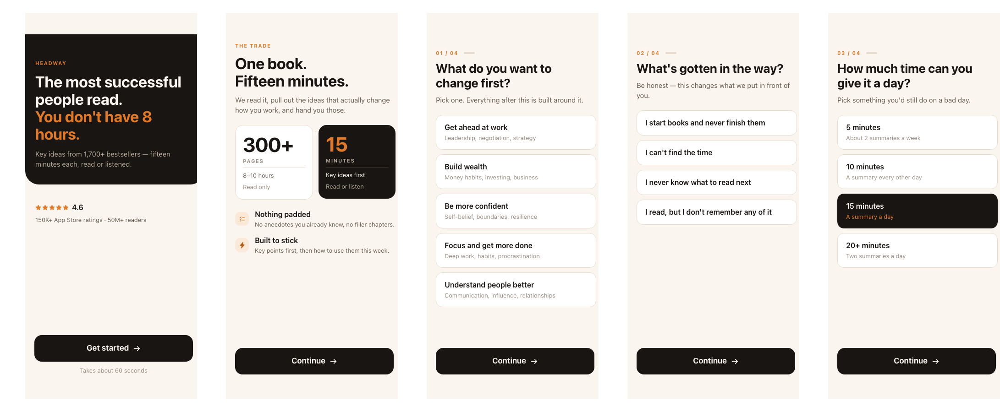
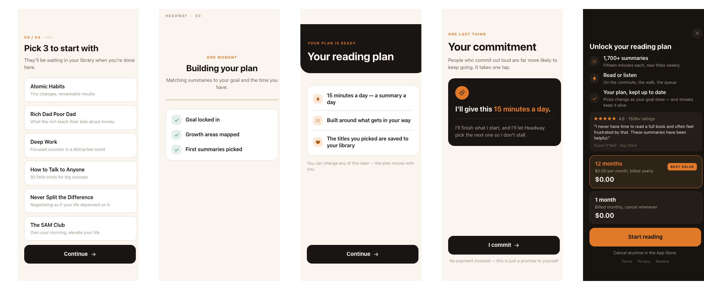

# Headway onboarding + paywall — a conversion rebuild

A 10-screen Adapty Flow that rebuilds [Headway](https://apps.apple.com/us/app/id1457185832)'s
onboarding and paywall, restructured for conversion rather than transcribed.

The original flow was read from a recorded replay: 35 onboarding steps, a sign-up gate at 0:23,
two permission prompts before the paywall, a nine-question quiz, a commitment pact, and a soft
paywall whose escape hatch leads to a *cheaper* annual plan. This rebuild keeps what works and
fixes what leaks.

Hook → method → goal → obstacle → pace → titles → loader → personalized plan → commitment pact →
paywall.




## The design system

**Paper and ink, with a marigold spark.** Warm paper page, near-black warm ink, and exactly one
saturated accent — no second hue competing for the same job.

- **Full-bleed ink hero blocks**, rounded only at the bottom, so the opener and the plan reveal
  read as printed stock rather than as cards floating on a tint.
- **The typographic scale does the work**: a 44pt numeral against an 11pt tracked label carries
  the 300-pages-versus-15-minutes trade without an illustration.
- **The selected state inverts** — ink fill, paper text, accent sub-line — instead of tinting.
  Unmissable at a glance, and it changes no geometry, so nothing reflows when you tap.
- **The paywall goes dark.** Nine light screens precede it, so the money moment reads as arriving
  somewhere rather than as one more card. The CTA is the only marigold fill on the screen.

Every colour is a theme token, so the whole system re-skins from `COLORS` in `build.py`. There
are no images anywhere in the flow — the visual interest is composition, scale and contrast,
which also means nothing here waits on an asset.

## What changed, and why

Each row is a pattern from Adapty's onboarding and paywall teardown libraries. Impact ranges are
expected effect, not measured lift for any one app.

| Headway's live flow | This rebuild | Rationale |
|---|---|---|
| Sign-up gate at 0:23, before the quiz | No sign-up anywhere in the flow | Mandatory registration front-loads friction before any value. Removing a sign-up wall tested at CR +8%, ARPU +17% |
| ATT prompt at 0:03 cold, notifications at 1:56 — both before the paywall | No permission prompts before the paywall | System dialogs pull attention while you are building momentum. Moving them past the paywall is worth ~CR +10–15%. A flow cannot request a permission anyway — that call belongs to the app |
| Paywall headline is generic: *"Try 7 days for free"* | Headline names the goal the user picked | The goal was already captured and then forgotten. Reflecting it on the paywall is ~CR +15–20% — the single biggest miss in the original |
| Gender, age, three consecutive pain-agreement screens, and a loader stalled at 49% asking three more questions | One obstacle question; the loader asks nothing | Inert steps. Every answer that survives is read by a later screen |
| Cheaper annual ($59.99) hidden behind *"View other plans"*; the front paywall shows $89.99/yr | Both plans visible, annual default and badged | An escape hatch that leads to a better price is a leak, not a fork |
| Two commitment ceremonies — a streak ladder and the pact | The pact only, echoing the user's own pace | A second ritual in an already long flow costs more than it earns |
| 35 steps | 10 | Depth converts when it pays off. These do |

Kept from the original because they are genuinely strong: the curiosity→payoff opener, the
300-pages-vs-15-minutes method card, the title picker as an investment step, and the commitment
pact.

### The personalization loop is real, not promised

`goal`, `obstacle` and `pace` are `single_choice` groups. Each one is read back by
`switch_rich` on the plan screen, the pact and the paywall headline — so the loader leads to an
actual payoff rather than to a paywall.

Goal is single-choice rather than the original's pick-up-to-3 for a mechanical reason: a
`multi_choice` group's `selectedOptionId` **cannot be read by a conditional** and fails the
publish gate. Titles stayed multi-choice — that step is investment, not a variable.

### Deliberately absent

Three patterns are missing because building them would have meant inventing a number, and a
fabricated offer or rating ships to real buyers:

- **No trial or trial timeline.** Education is a vertical where trials lift LTV and the original
  leans entirely on one, but no verifiable intro offer exists on the annual product. Confirm the
  offer and the Today / Day-5 / Day-7 timeline screen goes in.
- **No second-chance discount** after the paywall closes (the original's treasure-chest −44%).
  Worth ~ARPU +10–15%, and it needs a real discounted product.
- **No savings percentage.** The annual card shows `prod_price_per_month`, derived by the SDK
  from the real store price, next to the monthly card's own price. The comparison is real and
  self-evident; an invented "SAVE 61%" would not be.

Only one verbatim App Store review was available, so the paywall uses a single static quote card.
Three real quotes would make it a proper swipeable `carousel`.

## Layout

```
build.py            # authors the whole config; the source of truth
flow.config.json    # the generated config, as written to Adapty
icons.json          # nine real Phosphor SVGs for _meta.icons
screens/            # a render of each screen, from this exact config
```

## Rebuilding

`build.py` imports `flowkit` from the
[Adapty skills plugin](https://github.com/adapty/adapty-skills) for Claude Code — adjust the
`REF` path at the top if yours lives elsewhere.

```bash
python3 build.py                                  # -> draft.json
adapty flows config validate <FLOW_ID> --app <APP_UUID> --config-file draft.json --json
adapty flows config update   <FLOW_ID> --app <APP_UUID> --config-file draft.json --json
```

The app and product UUIDs at the top of `build.py` point at an Adapty demo app. Swap them for
your own — `adapty products list --app <APP_UUID>` gives the product IDs, and both plan cards
need a product whose `period` matches what the copy claims.

`_meta.screens` is generated by `flowkit.predeclare()` so the draft previews on a device without
being published first. When editing a flow that already exists, carry the live `_meta.screens`
forward instead — those declarations are builder-owned.

## Verification status

- Structural check clean; `flows config validate` returns `valid: true`.
- All ten screens rendered and reviewed; the screenshots here are from this exact config.
- The JSON-schema check flags the `purchase` action. That is version drift — the shape is
  byte-identical to a published flow that renders today.

Not reachable by any local check, and worth a device pass: the loader's auto-advance, selected
states on tap, the progress dots advancing, real store prices, and the goal-switched copy — a
render only ever draws the default branch.

The loader's timer carries a temporary seconds counter as a diagnostic: digits never appearing
means the element is not mounting, digits reaching zero with no navigation means the trigger is
not firing. Remove that text element once confirmed, but **leave the wordmark beside it** — a
timer with no children does not fire at all.
